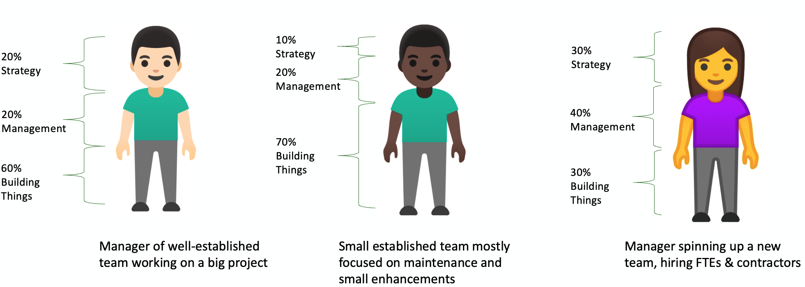

# Being an Engineering Manager at IH

[Job Description](../job-descriptions/engineering_manager) · [Progression Document](../engineering_manager)

You are a [player-coach](https://www.cultureamp.com/blog/support-player-coach) — equally invested in the technical work and in the people, culture, and conditions that let your team thrive.
Your responsibilities span three broad areas: strategy and planning, people management, and building things.
You're operating inside a large company, which means some structure and process. But the goal is always the same: clear the path for your team to do great work.

Our systems touch residents in hundreds of thousands of homes: the app they use to pay rent, the portal for maintenance requests, the tools associates depend on every day.
The teams you build and lead build those systems.
When we get it right, people feel it.

("Residents" are the people who live in our homes; "associates" are our employees.)

> *"Much of the job of an effective engineering manager is non-technical in nature: prioritization, communication, risk-awareness, connecting silos, inspiring teams, growing new leaders, and so forth.
> This makes success less visible, or at least less obvious."*
> — [Thiago Ghisi](https://twitter.com/thiagoghisi)

No two managers will look the same.
The mix of responsibilities you carry will shift based on your own stage as a manager, the maturity of your pod (the cross-functional team you lead), and the clarity of your product direction.
Pod maturity has a few dimensions: the experience of the individual team members, how long they've been working together, and where they fall on the [Tuckman stages](https://en.wikipedia.org/wiki/Tuckman%27s_stages_of_group_development) of group development.

*How the mix of responsibilities shifts depending on your team's situation*

## Strategy and Planning

### Pod Leadership

Your pod is led by a triad: you, your Product Owner, and your Product Designer.
Our pods are intentionally small — typically 7 to 10 people — in the spirit of the [two-pizza rule](https://aws.amazon.com/executive-insights/content/amazon-two-pizza-team/): small enough to stay nimble, aligned, and well-coordinated.
As the EM, you'll typically have 3–5 FTEs and 3–5 contractors as direct reports.
Your FTE direct reports are on the full people management journey described in this document: 1:1s, performance reviews, career development, the works.
Your relationship with contractors is different: you direct their work, give feedback, and set them up to succeed, but formal performance management runs through their agency or vendor.
You are responsible for building a strong working relationship with your counterparts and leading the pod together.
The triad owns planning and execution, maintains a healthy backlog, and is accountable for building a safe, [generative](https://cloud.google.com/architecture/devops/devops-culture-westrum-organizational-culture) team culture.
Each role has a distinct focus:

**Product** defines the vision, shapes the roadmap, and prioritizes features based on user and market signals.

**Product Design** translates user needs into clear, tested experiences, owning research, interaction patterns, and the visual language across the pod's product surface.

**Engineering** — that's you — provides technical guidance and mentorship, oversees planning and delivery, builds a culture of craft and momentum, and is accountable for the health and quality of what the pod ships.

### Project Management

For large projects, you'll work alongside an assigned Project Manager from our enterprise project management office (ePMO), who coordinates resources, manages timelines, and tracks progress.
For smaller projects, you and your Product Owner own delivery together.

### Agile Ceremonies and Metrics

You are responsible for running your pod's agile ceremonies (sprint planning, standups, backlog refinement, sprint reviews, and retrospectives) and reviewing sprint metrics to surface signals about team health and delivery.
The specific responsibilities for each ceremony are documented in the Operating Model in Confluence.

### Code Stewardship

Each pod maintains a **KLO** (Keep the Lights On) backlog — work that keeps the codebase healthy: addressing technical debt, improving developer experience, increasing automated test coverage, reducing toil, and following through on retrospective action items.
These are our automation and quality principles in action. If something can be automated or improved, we don't let it linger.
Target roughly 10% of each sprint's capacity for this work, and flag each issue in Jira as KLO.
Work with your Product Owner to pull this work into each sprint, and maintain a 2–3 sprint queue so the pod always has it ready to go.

## People Management

The [career progression framework](../) is one of your primary tools as a people manager.
Study it, and build a clear picture of the levels and expectations for the [engineers](being-an-engineer) and [SE4s](being-a-software-engineer-iv) reporting to you. It should inform how you coach, give feedback, and think about growth.
You are also an ally and advocate for your team: representing their interests to senior leadership, removing friction from other parts of the organization, and ensuring they have what they need to do their best work.

### Live Our Principles and Build Our Culture

You are expected to live our [engineering principles](../engineering_principles), model them for your pod, and encourage the team to follow them — or at least aspire to.
One principle worth calling out explicitly: speak up when you disagree.
Your voice matters, and holding back a concern doesn't serve the team.
But once a decision is made, commit fully so the team can succeed as one.
Modeling that behavior as a leader sets the tone for how the whole pod operates.
All of your work and interactions with the team should serve to build our culture and drive us toward our vision:

*delight our residents and associates with innovative solutions built by happy teams.*

We mean the 'happy teams' part.
Engineers who feel trusted and invested in do better work, stay longer, and build better things.

### Recognition and Feedback

Recognition and feedback are two of the greatest gifts you can give as a manager.
The value of a kind word when someone does a good job is incalculable.
Each week, engineering leadership publishes an asynchronous update in Microsoft Teams, and giving kudos to teammates is a standing norm.
The weekly thread shouldn't be the only place: a shoutout in standup (if the person is amenable), a quick Teams message, an email, or a "Kudos" post (our internal peer recognition program) all go a long way.
Loop in senior leaders when appropriate.

Constructive feedback matters just as much. It is how we continuously improve our craft.
We owe it to our folks to help them be as good as they can be, especially around areas for improvement.
Give it as close to the event as possible, and do it privately.
The goal is to open someone's eyes to a gap and help them grow, not to shame or embarrass.

### One-on-Ones

We believe, and research backs this up, that managers need a deep commitment to their people's success.
The most direct way to demonstrate that is by investing time each week in your direct reports.
One-on-ones are your primary vehicle for coaching, your best signal on individual health, and your early warning system when something is off.
Resources for running effective one-on-ones are documented in the Engineering space in Confluence.

### Performance Reviews

Conduct a mid-year and annual review with each of your direct reports.
Mid-year reviews offer a chance to reassess progress toward goals, provide timely feedback, and course-correct before the year is out.
Annual reviews cover a broader evaluation: performance over the full year, growth, and recognition of contributions.
Both serve to align individual performance to organizational goals, surface development needs, and ensure your people feel valued and supported in their growth.

### Hiring

Hiring needs are driven by team growth, attrition, and the demands of the work ahead. You might be actively recruiting within your first few months, or it may be a year before you hire.
Either way, familiarize yourself with the process before you need it, and reach out to your manager if you want a walkthrough.

When you are hiring, lead end-to-end: own the pipeline, represent Invitation Homes well to every candidate, and deliver a great candidate and new hire experience.

### Metrics

Data should inform our decisions.
Two tools give you a view into your pod's health.
The **Tableau Agile Metrics Reports** surface your agile delivery data: sprint velocity, throughput, and execution trends.
[**DX**](https://getdx.com) provides a complementary picture: quarterly developer experience surveys that capture how engineers feel about their work, alongside continuous engineering metrics covering deployment frequency, lead time, and change failure rate.
Together, they tell you not just how fast your team is moving, but whether the conditions for sustainable, high-quality work are in place.
Use them to understand what's working, where friction is building, and where to focus your attention.

## Building Things

### Creating and Running Software

Our approach to creating and running software covers the full lifecycle: how we build, test, deploy, and operate our systems, including practices around CI/CD, code quality, observability, and on-call.
It's documented in Confluence, and as a pod leader you are responsible for implementing these practices within your pod and holding the team accountable for following them.

We believe teams should own what they build, including running it in production.
There is no separate operations team; your pod is responsible for the reliability, performance, and health of the systems it owns.
That means on-call is part of the picture: your team will carry a rotation, and as EM you help set the culture around how that responsibility is shared and sustained without burning people out.
This is also where our bias to action and drive to keep things shipping matter most: removing blockers, maintaining momentum, and continually delivering value are as central to your job as any technical contribution.
You are also expected to stay technically engaged: participate meaningfully in solution architecture, guide technical decisions, and stay close to the code.
We want the teams building things to have a large hand in designing them. Your technical voice in that process matters.
How directly you contribute will vary. A well-established team in execution mode calls for a different kind of hands-on involvement than a team you're just spinning up.
AI coding assistants are increasingly making it easier for EMs to stay in the work even as management responsibilities grow; we encourage you to lean into them.

### Documentation

Use [Decision Records](https://cognitect.com/blog/2011/11/15/documenting-architecture-decisions) to capture significant technical decisions, either in the relevant repository (for decisions scoped to that codebase) or in our shared technology decisions repository (for decisions with org-wide impact).
Decision records exist so that future engineers, including future you, can understand not just what was decided, but why.
Without them, context lives in people's heads, and leaves when they do.

Every repository your pod owns should also have a great README: one that tells a new engineer what the system does, how to get it running, and where to look next.
A great README pays off immediately in onboarding and long-term maintainability.

Treat documentation more broadly as a first-class citizen alongside source code: create Jira stories for documentation work, include documentation in your definition of done, and ensure your pod's Confluence space has up-to-date architectural diagrams and object model representations.
Writing things down is how we avoid knowledge silos, one of the failure modes we work hardest to prevent.
You are responsible for curating that space and encouraging the team to contribute to it.

### Change Management

You serve on the Change Approval Board (CAB) as the primary representative for your pod.
The CAB meets for 30 minutes once a week to review the highest-risk changes happening across our teams. It's a lightweight but valuable cross-team touchpoint.
Familiarize yourself with our Change Management process in Confluence.
You'll also receive daily emails summarizing recent deployments and upcoming changes over the next seven days. Read them, and flag anything that could affect your pod's systems or work.

### Postmortems

When incidents occur, we follow our Incident Response Process and then conduct a [Blameless Postmortem](https://sre.google/sre-book/postmortem-culture/).
This reflects our commitment to quality and to continuously improving our craft. We treat failures as learning opportunities, not occasions for blame.
The Incident Manager will schedule the postmortem and set up a starter document for the meeting.
You are responsible for refining that document before the meeting, leading the discussion toward the topics that matter most, and documenting the lessons learned, action items (typically linked Jira tasks), and executive summary afterward.

## Administrative Responsibilities

### Tracking Capital Time

A large part of your job is helping your pod execute its work.
As a player-coach, you contribute directly to that success in many ways, and we need to track your time accordingly.

Building software is an investment by the company, and the dollars we invest can be capitalized over the software's useful life.
Capital spending is treated differently from expense spending in accounting, and capitalizable time allows us to increase our overall spending, which directly translates into headcount for our projects.
Enter your time each month as allocations in Quickbase (our project management and time-tracking system), assigned to the appropriate project, BAU (Business As Usual), or KLO bucket.
The expected split is roughly:

| Activity | Hours Per Week | % of Time |
| --- | --- | --- |
| Project Work | 28 hrs (3.5 days) | ~70% |
| Admin/Management (1:1s, reviews, coaching, mentoring) | 8 hrs (1 day) | ~20% |
| BAU/KLO | 4 hrs (0.5 days) | ~10% |

"Project Work" here doesn't mean hands-on coding alone. It includes everything you do as a manager to help the team execute: facilitating decisions, unblocking work, participating in architecture, coordinating with stakeholders, reviewing PRs, and all the glue work that keeps things moving.
Direct technical contribution is part of it, but so is everything else that doesn't fall neatly under admin or BAU.

This will vary based on your pod's maturity and the type of work it does.

From here, you'll have a clear path to [Director of Engineering](being-a-director-of-engineering) as your scope expands from a single pod to an operating group and the managers who run it.
